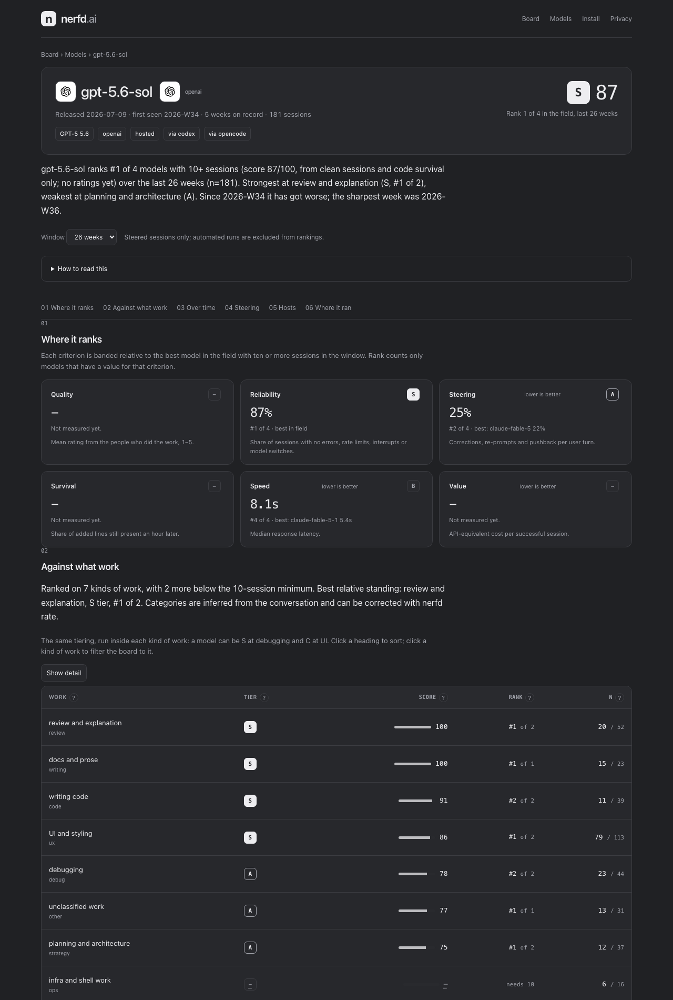

# nerfd

**The public record of how AI coding models actually perform on real work.**

nerfd is a local-first scorecard for the AI coding agents you already use. A one-line install hooks into Claude Code, Codex, OpenCode, Gemini CLI, Qwen Code, Kimi Code, Goose, Crush and Copilot CLI, measures every session on your machine, and tells you which model earned its keep on which kind of work, what your subscription actually bought, and the week a model changed. With sharing on, a redacted record of each session joins the public board at [nerfd.org](https://nerfd.org). Counts, never conversations.

- **Live**: [nerfd.org](https://nerfd.org) · [the board](https://nerfd.org/board) · [one page per model](https://nerfd.org/model) · [what leaves your machine](https://nerfd.org/privacy) · [open data, CC BY 4.0](https://nerfd.org/export.json)
- **Zero runtime dependencies.** Node 22.13+ runs the TypeScript directly. Small enough to read over a coffee, which is the point.
- **No money from model labs, ever.** Every evaluator that took lab money ended up ranking its customers.


## Why

Nobody knows which model to use for which kind of work this week. Lab benchmarks are static and measure a model through the lab's own harness. Social media is anecdote with no denominator. Model quality genuinely moves: Anthropic has published two postmortems admitting multi-week degradations their own evals did not catch, one of them caused by harness changes rather than weights. The people who can see this are the people doing real work in these terminals every day, and their evidence evaporates into posts.

nerfd turns that evidence into a record. Every session becomes a row of counts: model, tool, plan, kind of work, prompts, edits, errors, corrections, interrupts, tokens, latency, and whether the code the session wrote is still there an hour later. The rows are scored the same way for one person and for everyone.

## What you get

**Your own report**, in one command, from your own sessions: which model ranks where on your work, what a month of your plan bought in successful sessions and API-equivalent value, how many tokens a window holds and how often you hit the wall, where the errors and re-prompting happened.

**The public board**: tiers on six criteria (quality, reliability, steering, survival, speed, value), the best model at each kind of work, the same open weights compared across hosts and quantisations, what each plan gives you, and how hard people had to push.

**One page per model**: its rank in the field, its standing inside each kind of work, and a week-by-week score since release with change flags on the week it moved, tested against its own baseline and against the whole field. Change detection, with the numbers, not a verdict.



## Quick start

```sh
curl -fsSL https://nerfd.org/install.sh | sh                      # install, hook every tool found, sharing on
curl -fsSL https://nerfd.org/install.sh | sh -s -- --no-share     # the same, sharing off
```

The installer downloads the CLI to `~/.nerfd/app`, links `~/.local/bin/nerfd`, installs hooks into every supported tool whose config directory exists, reads your subscription plan off those tools' own config, and prints exactly what would be sent. Then:

```sh
nerfd backfill --since 90d      # import the history your tools already wrote; a populated scorecard on day one
nerfd report                    # your report as one HTML page
nerfd sessions                  # what was captured
nerfd rate last 4 kept          # optional two-second rating; inside the tool: /nerfd 4 kept "why"
nerfd which debug --lang ts     # what to use right now, from your own history
nerfd cost                      # cost per success, waste, what the plan bought
nerfd privacy                   # everything stored locally, and the exact record that would be sent
nerfd share off                 # stop sharing; nerfd init --remove takes the hooks out
```

Any other tool or script reports with `nerfd record --tool <name> --model <id> --cat debug --duration 840 --rating 4 --kept --tokens-in 120000 --tokens-out 9000`.

## How it works

```
your tool ──hook JSON──▶ nerfd hook ──▶ ~/.nerfd/local.db ──▶ nerfd report · which · cost · dash
                                             │
                                   redact (counts only)
                                             │
                                     POST /v1/reports ──▶ the board
```

1. **Hooks** in each tool give session boundaries, tool calls, errors and interrupts as they happen. The tool's own transcript or store gives tokens, latency and the model actually used.
2. **At session end**, the conversation is reduced to integers on your machine: corrections, re-prompts, pushback, frustration markers, clarifying questions, edits without a prior read, the kind of work. The text is dropped before the function returns.
3. **An hour later**, `nerfd check` re-hashes the working tree to measure how much of what the session wrote survived.
4. **With sharing on**, one small JSON record per session goes to the board. The reporter id is a hash of a random install id, rotated weekly, so sessions cannot be linked across weeks.

Score, published and deliberately simple: `score = 0.55 × rating + 0.30 × survival + 0.15 × clean`, missing parts dropped and weights renormalised, nothing scored under three sessions, no public tier under ten. Tiers are relative to the best model in the field. Drift is a z-score against the trailing four weeks and needs five sessions to flag. The full method: [docs/METHOD.md](docs/METHOD.md).

## Supported tools

| Tool | Live capture | History import | Notes |
|---|---|---|---|
| Claude Code | hooks | yes | plus a status-line sampler for subscription windows |
| Codex | hooks, after you trust them | yes | Codex skips a hook until you trust it in `/hooks`; the Codex app and the ChatGPT app's Codex are covered by backfill; rollout logs carry window usage |
| OpenCode | plugin | yes | model, provider and quantisation from the session store |
| Gemini CLI, Qwen Code | hooks | yes | |
| Kimi Code | hooks | yes | |
| Goose | hooks | yes | |
| Crush | one hook | yes | the rest from its per-project database |
| Copilot CLI | hooks | yes | |
| Cline, Aider | none | yes | read from their stores only |
| anything else | `nerfd record` | | |

Per-tool detail, including what each one cannot give: [docs/INTEGRATIONS.md](docs/INTEGRATIONS.md). Open-weight models are identified by family, version, size, quantisation, provider and serving mode, so a local q4 run and a hosted fp8 endpoint of the same weights are never averaged together: [docs/MODELS.md](docs/MODELS.md).

## Privacy

Only with sharing on, and only this: model identity, effort level, tool and version, plan tier, ISO week, kind and size of work, repo language and size buckets, duration, counts, behavioural signal counts, token totals, latency percentiles, subscription window usage, your rating if you gave one, and the survival ratio. Never prompts, code, paths, repo names or notes. The detector that reads your plan opens one named field per tool, never the keychain, and makes no network call. `nerfd show last --public` prints the exact payload. The whole statement, written for the person who has to approve it: [docs/PRIVACY.md](docs/PRIVACY.md).

## Documentation

| | |
|---|---|
| [docs/METHOD.md](docs/METHOD.md) | principles, what is measured, tiers, scoring, architecture |
| [docs/MODEL-VIEW.md](docs/MODEL-VIEW.md) | the model page, kinds of work, change detection over time |
| [docs/LIMITS.md](docs/LIMITS.md) | tokens versus limits: window capacity, generosity per plan |
| [docs/SIGNALS.md](docs/SIGNALS.md) | the behavioural signals and their known false positives |
| [docs/PLAN-DETECTION.md](docs/PLAN-DETECTION.md) | how the subscription plan is read, and what is never read |
| [docs/REPORT.md](docs/REPORT.md) | the personal report |
| [docs/INTEGRATIONS.md](docs/INTEGRATIONS.md) | every tool, what it gives and what it cannot |
| [docs/PRIVACY.md](docs/PRIVACY.md) | what leaves the machine, and how to stop it |

## Self-hosting

The Node server is the whole public site: landing, board, model pages, privacy page, installer, API and open-data export.

```sh
pnpm install
pnpm release                                   # builds dist/nerfd.tgz, which /install.sh serves
pnpm server -- --port 8787 --db ./reports.db
```

Behind a reverse proxy, set `x-forwarded-proto` and `x-forwarded-host` so the installer bakes in the public origin. For a serverless platform, wrap `queryData` and the page renderers in `packages/server/src`; nerfd.org is one such wrapper. Endpoints: `GET /v1/tiers`, `/v1/work`, `/v1/model?id=`, `/v1/stats?by=model,category`, `/v1/providers`, `/v1/friction`, `/v1/limits`, `/v1/plans`, `/v1/drift`, `/v1/meta`, `/v1/founders`, `/export.json`; `POST /v1/reports`.

## Repository

```
packages/core     types, classifier, stats, aggregation, pricing, tiers, plans, limits, views, redaction, validation
packages/cli      the nerfd command: adapters, hooks, local SQLite, report, commands
packages/server   the site: landing, board, model pages, privacy, installer, ingest. Same aggregation as the CLI
scripts/          release tarball, price snapshot
docs/             method and integration docs
```

```sh
pnpm typecheck
pnpm test
```

Contributions are welcome, and the easiest first ones are an adapter for a tool we do not cover, a behavioural signal, or a fix to the model family table. Read [CONTRIBUTING.md](CONTRIBUTING.md) first: it lists the rules a change cannot break.

## Roadmap

- **Verified reporters**: an opt-in stable identity that weights higher than a weekly-rotating one, both shown.
- **Rematch**: rerun the last task on a second model and record which diff survived, the within-person paired comparison nobody has.
- **Attribution**: separate a weights change from a harness change from capacity, keyed on tool version and effort distribution.
- **Alerts**: subscribe to a model and hear when it moves against its own baseline.
- **Adapters**: Droid, Kilo Code and Cursor CLI.
- **A hand-labelled sample** to measure the behavioural detectors against, rather than reasoning about them.

## Licence

MIT. See [LICENSE](LICENSE). The public dataset at [nerfd.org/export.json](https://nerfd.org/export.json) is CC BY 4.0.
