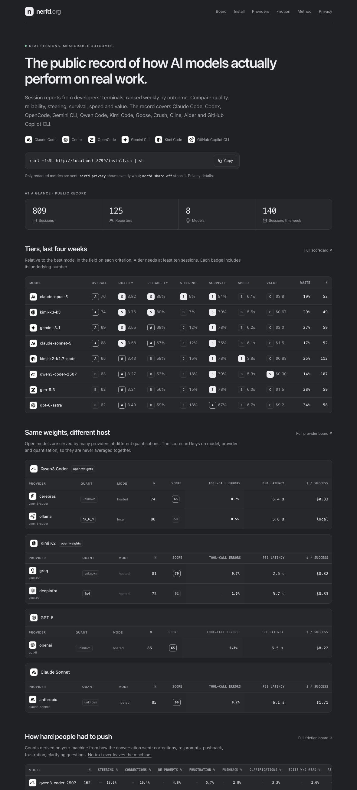

# nerfd

The public record of how AI models actually perform on real work. Captured automatically from Claude Code, Codex, OpenCode, Goose, Gemini CLI, Qwen Code, Kimi Code, Crush, Copilot CLI, Cline and Aider sessions, ranked weekly by outcome, priced by what a good result really costs on your subscription and at API rates — and, because the same open weights are served at different quantisations by different hosts, scored by provider and quantisation as well as by model.

Plan, context, market research, the multi-tool integration plan, the behavioural signals, the plan detector and the privacy statement: [docs/PLAN.md](docs/PLAN.md), [docs/MARKET.md](docs/MARKET.md), [docs/INTEGRATIONS.md](docs/INTEGRATIONS.md), [docs/SIGNALS.md](docs/SIGNALS.md), [docs/PLAN-DETECTION.md](docs/PLAN-DETECTION.md), [docs/PRIVACY.md](docs/PRIVACY.md).



## Install (users)

```
curl -fsSL https://<your-host>/install.sh | sh                      # sharing on
curl -fsSL https://<your-host>/install.sh | sh -s -- --no-share     # sharing off
NERFD_SHARE=off sh -c "$(curl -fsSL https://<your-host>/install.sh)"  # same, for scripted installs
```

Needs Node 22.13 or newer. The script downloads the CLI to `~/.nerfd/app`, links `~/.local/bin/nerfd`, installs hooks into every supported tool whose config directory exists, reads your subscription plan off those tools' own config, and turns on autonomous reporting of redacted session records to the host it was downloaded from. It prints exactly what is sent. `nerfd share off` stops it; `nerfd init --remove` takes the hooks out.

Then:

```
nerfd sessions                       # what was captured
nerfd plan                           # your subscription per tool, auto-detected, with what was read to find it
nerfd plan claude claude-max-20x     # declare one; a declared plan always overrides detection
nerfd backfill --since 90d           # import the history your tools recorded before nerfd existed
nerfd rate last 4 kept               # optional two-second rating; inside your tool: /nerfd 4 kept "why"
nerfd which debug --lang ts          # what to use right now, from your own history
nerfd cost                           # api-equivalent cost, cost per success, waste, and what your plan bought this month
nerfd drift                          # week over week per model
nerfd privacy                        # everything stored locally, and the exact record that would be sent
nerfd dash                           # local board on http://localhost:8787
```

## Which tools

`nerfd init` installs into whatever it finds. **Claude Code, Codex, OpenCode, Goose, Gemini CLI, Qwen Code and Kimi Code** are fully live: hooks (or, for OpenCode, a small plugin) give session boundaries, tool calls, errors and interrupts as they happen, and the tool's own transcript or SQLite store gives tokens, cost and the model actually used. **Crush** has exactly one hook — `PreToolUse` — so it runs live on that and fills in the rest from its per-project database. **Copilot CLI** installs hooks as individual files in `~/.copilot/hooks/*.json` and reads its `session-state` event log. **Cline and Aider** emit nothing live and are read from their stores only. Every one of them supports `nerfd backfill [tool] --since 90d`, which imports history that predates the install, so a personal scorecard is populated the minute you install rather than in a fortnight. Anything else reports through `nerfd record`. Per-tool detail, including what each one cannot give: [docs/INTEGRATIONS.md](docs/INTEGRATIONS.md).

Any other tool or script:

```
nerfd record --tool aider --model claude-sonnet-5 --cat debug --duration 840 --rating 4 --kept --tokens-in 120000 --tokens-out 9000
```

## What leaves the machine

Only when sharing is on, only this: model and the model identity derived from it (family, version, size, quantisation, provider, serving mode), effort level, tool and version, plan tier and whether it was declared or detected, ISO week, task category and size, repo language and size and age buckets, duration, counts (prompts, turns, tool calls, edits, files, tests, errors, rate limits, timeouts, interrupts, model switches, tool-call errors, context-limit hits), behavioural signal counts with their detector version, token totals, latency percentiles, subscription window usage where the tool reports it, your rating and kept flag if given, the code survival ratio, and an optional gist link you attach yourself. Never prompts, code, paths, repo names, or notes — and detection's own evidence (which file and field it read) never leaves either. The reporter id is a hash of a random per-install id, rotated weekly. `nerfd show last --public` prints the exact payload, and `nerfd privacy` prints it alongside everything held locally. Full statement: [docs/PRIVACY.md](docs/PRIVACY.md).

## Run the site (operators)

```
pnpm install
pnpm release                                   # builds dist/nerfd.tgz, which /install.sh downloads
pnpm server -- --port 8787 --db ./reports.db   # landing at /, board at /board, installer at /install.sh
```

Behind a proxy, set `x-forwarded-proto` and `x-forwarded-host` so the installer bakes in the public origin, or pass `publicOrigin` to `startServer`.

Endpoints: `GET /` landing, `GET /board`, `GET /privacy`, `GET /install.sh`, `GET /dist/nerfd.tgz`, `GET /v1/tiers`, `GET /v1/plans`, `GET /v1/stats?by=model,category&weeks=8` (also `by=family,provider,quant,serving_mode`), `GET /v1/providers?weeks=8&min=10`, `GET /v1/friction?weeks=8`, `GET /v1/drift`, `GET /v1/meta`, `GET /export.json`, `POST /v1/reports`.

## Layout

```
packages/core     types, classifier, stats, aggregation, pricing, tiers, plans, redaction, validation
packages/cli      ms: hooks, local sqlite, commands, local board
packages/server   node:http site: landing, board, installer, ingest. same aggregation as the CLI
scripts/release.ts  builds the install tarball
docs/             plan and market research
```

Zero runtime dependencies. Node runs the TypeScript directly; there is no build step beyond the tarball.

## Develop

```
pnpm typecheck
pnpm test
NERFD_HOME=/tmp/mshome pnpm nerfd sessions   # isolated data dir
```

Hook errors never surface in the host tool; they go to `~/.nerfd/hook.log`. `nerfd doctor` shows the tail. Model list prices live in `packages/core/src/pricing.ts`, subscription plans in `packages/core/src/plans.ts`.

## Deploy to Cloudflare (nerfd.org)

The public site runs as a Cloudflare Worker. Reports persist in the `Reports`
SQLite Durable Object; the CLI and local dashboard retain their Node SQLite store.
`wrangler.jsonc` pins the account (`[account id]`)
and the `nerfd.org` / `www.nerfd.org` custom domains. `www` redirects to the apex.

```sh
pnpm install --frozen-lockfile
pnpm cf:login       # first use: select only your account
pnpm cf:whoami      # confirm the account before deploying
pnpm typecheck
pnpm cf:check
pnpm test
pnpm cf:deploy
```

The `cf:*` commands isolate OAuth credentials under
`~/.config/nerfd-cloudflare`, so another project's Wrangler login is unaffected.
Never commit credentials. The deployed installer uses `https://nerfd.org` as its
origin. `cf:deploy` builds the CLI archive and static assets before uploading the
Worker. No local database, sample reports, or environment files are uploaded.
The public release archive includes the source needed to run the CLI.

For a local Worker check, run `pnpm cf:build` then `pnpm exec wrangler dev --port 8791` and, in another
terminal, `pnpm cf:smoke`. The check writes synthetic reports only to the
local Worker database. Production verification should check `/health`, `/v1/meta`,
`/board`, `/install.sh`, and `/dist/nerfd.tgz` without adding sample sessions.

This repository uses explicit command-line deployment. There is no Git remote or
automatic push-to-deploy integration configured yet. Cloudflare storage persists
across Worker deploys; do not delete the Durable Object namespace during updates.
